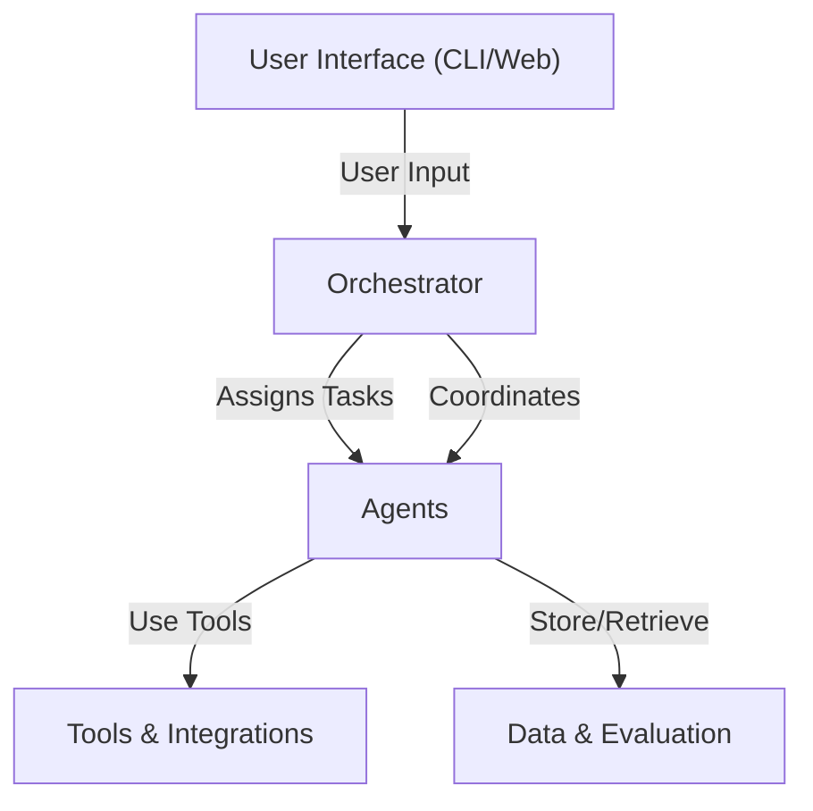

# ProximaAI: Multi-Agent Job Search & Resume Assistant

ProximaAI is an AI-powered job search and resume assistant inspired by Anthropic's multi-agent research system. It leverages multi-agent technology and the Lang ecosystem to accelerate your career journey.


## Project Vision
- **AI-powered job search**: Automate job discovery, matching, and application.
- **Resume assistant**: Optimize and tailor your resume for each opportunity.
- **Multi-agent system**: Specialized agents collaborate to deliver results.

## Architecture Overview
ProximaAI mirrors the architecture described in Anthropic's "How we built our multi-agent research system":

- **Agents**: Specialized AI agents (e.g., Job Finder, Resume Optimizer, Application Tracker).
- **Orchestrator**: Manages agent communication, task assignment, and workflow.
- **Tools**: Integrations with external APIs (job boards, resume parsers, LangChain, etc.).
- **Interface**: User-facing CLI or web interface.
- **Data**: Storage, models, and evaluation utilities.


### How we design our Multi Agent System


## Directory Structure
```plaintext
src/
  proximaai/
    agents/         # Agent definitions and logic
    orchestrator/   # Multi-agent orchestration and communication
    tools/          # Integrations (LangChain, job APIs, resume parsers, etc.)
    interface/      # User interfaces (CLI, web, etc.)
    data/           # Data models, storage, and evaluation
    utils/          # Shared utilities/helpers
    __init__.py
  tests/
    agents/
    orchestrator/
    tools/
    interface/
    data/
    utils/
scripts/            # Dev scripts, data importers, etc.
```

**Why `src/`?**
- Keeps the root clean and avoids import issues.
- Follows modern Python best practices for applications.
- Scales well for research and production.

## Getting Started

### Prerequisites
- Python 3.10 or higher
- [uv](https://docs.astral.sh/uv/) package manager

### Installation

1. **Clone the repository:**
   ```bash
   git clone https://github.com/yourusername/ProximaAI.git
   cd ProximaAI
   ```

2. **Install dependencies and set up development environment:**
   ```bash
   uv sync --dev
   ```
   This command will:
   - Install all project dependencies
   - Install the package in development mode
   - Set up the virtual environment

3. **Activate the virtual environment (if needed):**
   ```bash
   source .venv/bin/activate  # On macOS/Linux
   # or
   .venv\Scripts\activate     # On Windows
   ```

### Running the Application

1. **Run the main agent:**
   ```bash
   python src/proximaai/orchestrator/main_agent.py
   ```

2. **Run tests:**
   ```bash
   uv run pytest
   ```

### Development Workflow

- **Adding new dependencies:** Update `pyproject.toml` and run `uv sync --dev`
- **Running scripts:** Use `uv run python script.py` or activate the venv first
- **Package imports:** The package is installed in development mode, so you can import `proximaai` from anywhere

## Development with LangGraph, LangSmith, and LangChain Studio

ProximaAI uses the Lang ecosystem for development, debugging, and monitoring. This section covers how to use LangGraph for development, LangSmith for tracing and debugging, and LangChain Studio for visualization.

### LangGraph Development Server

LangGraph provides a development server that allows you to run and test your multi-agent system locally with a web interface.

#### Starting the Development Server

1. **Start the LangGraph dev server:**
   ```bash
   # Using uv (recommended)
   uv run langgraph dev
   
   # Or using the CLI directly
   langgraph dev
   ```

2. **If you encounter port conflicts, specify a different port and set up tunneling for Macs:**
   ```bash
   langgraph dev --port 8001 --tunnel
   ```

3. **The server will start and provide:**
   - **API Endpoint**: `http://localhost:8000` (or your specified port)
   - **API Documentation**: `http://localhost:8000/docs`
   - **Studio UI**: Accessible via LangChain Studio

#### Using the API

The development server exposes a REST API for interacting with your agents:

```bash
# List available assistants
curl -X POST http://localhost:8000/assistants/search \
  -H "Content-Type: application/json" \
  -d '{"limit": 10}'

# Create a new thread
curl -X POST http://localhost:8000/threads \
  -H "Content-Type: application/json" \
  -d '{"metadata": {"user_id": "test_user"}}'

# Run the agent on a thread
curl -X POST http://localhost:8000/threads/{thread_id}/runs/stream \
  -H "Content-Type: application/json" \
  -d '{
    "assistant_id": "main_agent",
    "input": {"message": "Help me find software engineering jobs"}
  }'
```

### LangChain Studio Integration

LangChain Studio provides a web-based interface for visualizing and interacting with your LangGraph applications.

#### Accessing Studio

1. **Open LangChain Studio:**
   ```
   https://smith.langchain.com/studio/?baseUrl=http://localhost:8000
   ```
   (Replace `8000` with your port if different)

2. **If using a different port:**
   ```
   https://smith.langchain.com/studio/?baseUrl=http://localhost:8001
   ```

#### Studio Features

- **Assistant Management**: View, create, and manage your agents
- **Thread Visualization**: See conversation threads and their states
- **Run Monitoring**: Monitor agent executions in real-time
- **Graph Visualization**: Visualize your agent workflows
- **Debugging**: Step through agent executions and inspect state

#### Troubleshooting Studio Connection

If you see "Failed to load assistants" in Studio:

1. **Verify the server is running:**
   ```bash
   curl http://localhost:8000/assistants/search \
     -X POST \
     -H "Content-Type: application/json" \
     -d '{"limit": 1}'
   ```

2. **Check CORS settings**: Ensure your browser can access localhost
3. **Use the correct base URL**: Make sure you're using `http://localhost:8000` (or your port)
4. **Check browser console**: Look for network errors in developer tools

### LangSmith Integration

LangSmith provides comprehensive tracing, debugging, and evaluation capabilities for your LangChain applications.

#### Setting Up LangSmith

1. **Get your API key:**
   - Sign up at [smith.langchain.com](https://smith.langchain.com)
   - Navigate to Settings → API Keys
   - Create a new API key

2. **Set environment variables:**
   ```bash
   # Add to your .env file
   export LANGCHAIN_API_KEY="your_api_key_here"
   export LANGCHAIN_TRACING_V2="true"
   export LANGCHAIN_ENDPOINT="https://api.smith.langchain.com"
   export LANGCHAIN_PROJECT="proximaai"  # Optional: specify project name
   ```

3. **Load environment variables:**
   ```bash
   # In your Python code
   from dotenv import load_dotenv
   load_dotenv()
   ```

#### Using LangSmith for Tracing

LangSmith automatically traces your LangGraph executions when properly configured:

```python
# Your agents will automatically be traced
from proximaai.orchestrator.main_agent import create_orchestrator_agent

# Create and run your agent
agent = create_orchestrator_agent()
result = agent.invoke({"message": "Find me a job"})
```

#### LangSmith Features

- **Trace Visualization**: See detailed execution traces of your agents
- **Performance Monitoring**: Track latency, token usage, and costs
- **Debugging**: Inspect intermediate steps and agent decisions
- **Evaluation**: Compare different agent versions and configurations
- **Dataset Management**: Create and manage test datasets

#### Viewing Traces

1. **Open LangSmith:**
   ```
   https://smith.langchain.com
   ```

2. **Navigate to your project** (defaults to "proximaai" if set)

3. **View recent traces** in the Traces section

4. **Click on any trace** to see detailed execution information

### Development Workflow with Lang Ecosystem

#### 1. Local Development
```bash
# Start the development server
uv run langgraph dev --port 8001

# In another terminal, test your API
curl -X POST http://localhost:8001/assistants/search \
  -H "Content-Type: application/json" \
  -d '{"limit": 5}'
```

#### 2. Studio Debugging
```bash
# Open Studio with your local server
open "https://smith.langchain.com/studio/?baseUrl=http://localhost:8001"
```

#### 3. LangSmith Monitoring
```bash
# Run your application with tracing enabled
LANGCHAIN_TRACING_V2=true uv run python src/proximaai/orchestrator/main_agent.py
```

#### 4. Production Deployment
```bash
# Build and deploy your application
langgraph build
langgraph up
```

### Configuration Files

#### langgraph.json
```json
{
  "dependencies": ["."],
  "graphs": {
    "main_agent": "./src/proximaai/orchestrator/main_agent.py:create_orchestrator_agent"
  },
  "env": "./.env",
  "python_version": "3.11"
}
```

#### .env (example)
```bash
# LangSmith Configuration
LANGCHAIN_API_KEY=your_api_key_here
LANGCHAIN_TRACING_V2=true
LANGCHAIN_ENDPOINT=https://api.smith.langchain.com
LANGCHAIN_PROJECT=proximaai

# Other environment variables
ANTHROPIC_API_KEY=your_anthropic_key
OPENAI_API_KEY=your_openai_key
```

### Best Practices

1. **Use uv for dependency management**: Ensures consistent environments
2. **Enable LangSmith tracing**: Always trace in development for debugging
3. **Use Studio for visualization**: Great for understanding agent workflows
4. **Monitor performance**: Use LangSmith to track latency and costs
5. **Version your agents**: Use LangSmith to compare different versions
6. **Test thoroughly**: Use the development server for integration testing

## Next Steps
- Implement agent classes in `src/proximaai/agents/`
- Build the orchestrator in `src/proximaai/orchestrator/`
- Integrate tools and APIs in `src/proximaai/tools/`
- Develop the user interface in `src/proximaai/interface/`
- Add tests in `src/tests/`

---
Inspired by Anthropic's [multi-agent research system](https://www.anthropic.com/research/how-we-built-our-multi-agent-research-system).
