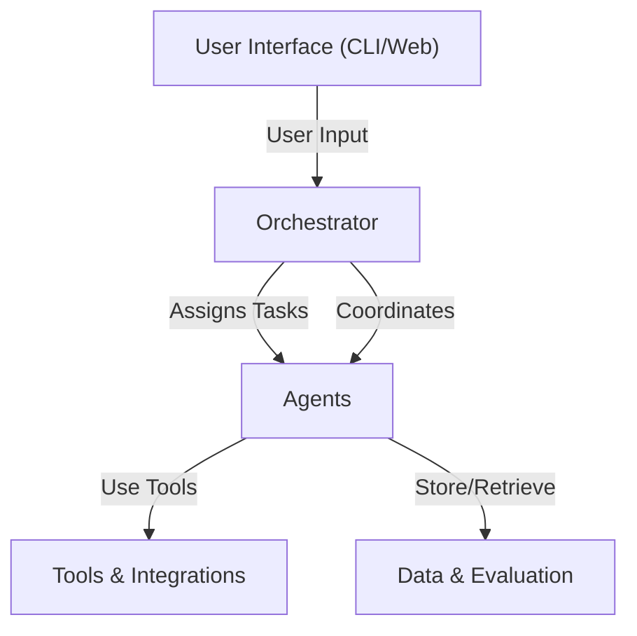

# ProximaAI: Multi-Agent Job Search & Resume Assistant

ProximaAI is an AI-powered job search and resume assistant inspired by Anthropic's multi-agent research system. It leverages multi-agent technology and the Lang ecosystem to accelerate your career journey.


## Project Vision
- **AI-powered job search**: Automate job discovery, matching, and application.
- **Resume assistant**: Optimize and tailor your resume for each opportunity.
- **Multi-agent system**: Specialized agents collaborate to deliver results.

## Architecture Overview
ProximaAI mirrors the architecture described in Anthropic's "How we built our multi-agent research system":

- **Agents**: Specialized AI agents (e.g., Job Finder, Resume Optimizer, Application Tracker).
- **Orchestrator**: Manages agent communication, task assignment, and workflow.
- **Tools**: Integrations with external APIs (job boards, resume parsers, LangChain, etc.).
- **Interface**: User-facing CLI or web interface.
- **Data**: Storage, models, and evaluation utilities.


### How we design our Multi Agent System

<iframe style="border: 1px solid rgba(0, 0, 0, 0.1);" width="800" height="450" src="https://embed.figma.com/design/lGVksTNnjkbYTdtO1gKruE/Multi-Agent-Research?node-id=5-2&embed-host=share" allowfullscreen></iframe>

## Directory Structure
```plaintext
src/
  proximaai/
    agents/         # Agent definitions and logic
    orchestrator/   # Multi-agent orchestration and communication
    tools/          # Integrations (LangChain, job APIs, resume parsers, etc.)
    interface/      # User interfaces (CLI, web, etc.)
    data/           # Data models, storage, and evaluation
    utils/          # Shared utilities/helpers
    __init__.py
  tests/
    agents/
    orchestrator/
    tools/
    interface/
    data/
    utils/
scripts/            # Dev scripts, data importers, etc.
```

**Why `src/`?**
- Keeps the root clean and avoids import issues.
- Follows modern Python best practices for applications.
- Scales well for research and production.

## Getting Started

### Prerequisites
- Python 3.10 or higher
- [uv](https://docs.astral.sh/uv/) package manager

### Installation

1. **Clone the repository:**
   ```bash
   git clone https://github.com/yourusername/ProximaAI.git
   cd ProximaAI
   ```

2. **Install dependencies and set up development environment:**
   ```bash
   uv sync --dev
   ```
   This command will:
   - Install all project dependencies
   - Install the package in development mode
   - Set up the virtual environment

3. **Activate the virtual environment (if needed):**
   ```bash
   source .venv/bin/activate  # On macOS/Linux
   # or
   .venv\Scripts\activate     # On Windows
   ```

### Running the Application

1. **Run the main agent:**
   ```bash
   python src/proximaai/orchestrator/main_agent.py
   ```

2. **Run tests:**
   ```bash
   uv run pytest
   ```

### Development Workflow

- **Adding new dependencies:** Update `pyproject.toml` and run `uv sync --dev`
- **Running scripts:** Use `uv run python script.py` or activate the venv first
- **Package imports:** The package is installed in development mode, so you can import `proximaai` from anywhere

## Next Steps
- Implement agent classes in `src/proximaai/agents/`
- Build the orchestrator in `src/proximaai/orchestrator/`
- Integrate tools and APIs in `src/proximaai/tools/`
- Develop the user interface in `src/proximaai/interface/`
- Add tests in `src/tests/`

---
Inspired by Anthropic's [multi-agent research system](https://www.anthropic.com/research/how-we-built-our-multi-agent-research-system).
