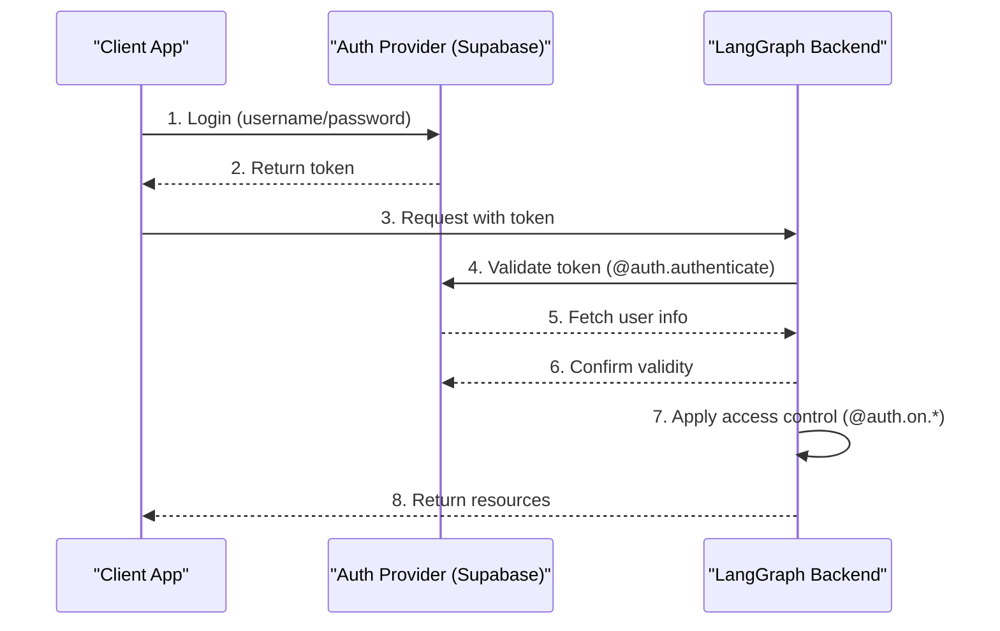

# Authentication and Authorization

```mermaid
sequenceDiagram
    participant CA as "Client App"
    participant AP as "Auth Provider (Supabase)"
    participant LB as "LangGraph Backend"
    CA->>AP: 1. Login (username/password)
    AP-->>CA: 2. Return token
    CA->>LB: 3. Request with token
    LB->>AP: 4. Validate token (@auth.authenticate)
    AP-->>LB: 5. Fetch user info
    LB-->>AP: 6. Confirm validity
    LB->>LB: 7. Apply access control (@auth.on.*)
    LB-->>CA: 8. Return resources
```