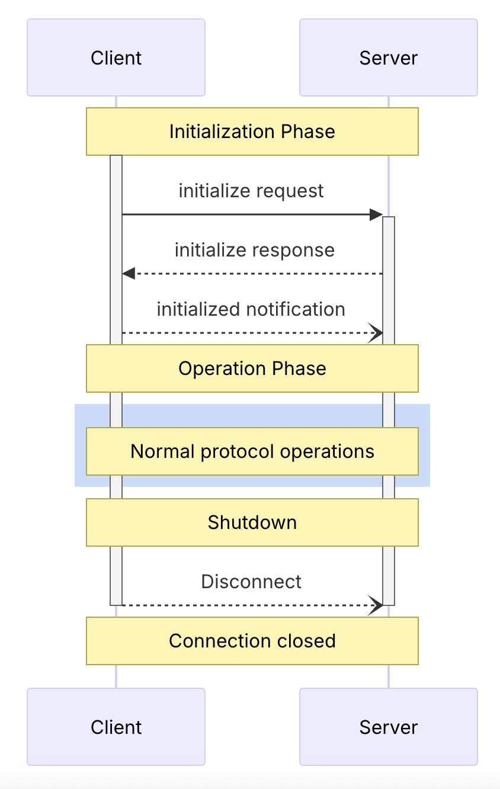

# MCP Tools (Model Context Protocol)

## Overview
MCP tools are external services or scripts that interact with your main app using the Model Context Protocol. They can be implemented in any language and typically run as separate server processes, communicating via stdio or HTTP.

## Using MCP Servers

### LangGraph Integration
- LangGraph supports MCP tools through the `langgraph-mcp-adapter` package, allowing you to expose tools to agents. [1]

### FastAPI Lifespan Support
- LangGraph natively supports FastAPI and Starlette for custom server lifespans, but not FastMCP directly. To run MCP servers during deployment, mount your MCP server within FastAPI's lifespan events. [2]

### MCP Protocol Basics
MCP defines a strict client-server lifecycle for robust capability negotiation and state management:

1. **Initialization**: Negotiate capabilities and agree on protocol version.
2. **Operation**: Standard protocol communication.
3. **Shutdown**: Graceful connection termination. [3]

In some workflows, we call third-party MCP servers directly (not as agent nodes) to reduce costs. We use deterministic nodes that communicate with MCP servers using JSON-RPC and async HTTP calls via httpx.

## References
[1]: https://langchain-ai.github.io/langgraph/agents/mcp/#use-mcp-tools  
[2]: https://langchain-ai.github.io/langgraph/how-tos/http/custom_lifespan/  
[3]: https://modelcontextprotocol.io/specification/2024-11-05/basic/lifecycle